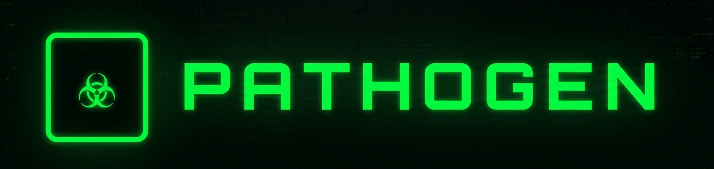

# 🦠 PATHOGEN — Malware Analysis Lab


<p align="center">
  
  
  
</p>

---

## 🔬 Overview

**PATHOGEN** is an interactive malware analysis lab that provides hands-on experience with 8 distinct malware types. This educational tool combines visual specimen dissection with network infection simulation to help cybersecurity professionals understand malware behavior and defensive strategies.

---

## ✨ Key Features

### 🧬 **Specimen Lab — 8 Malware Types** (Module 01)

- **Interactive malware catalog** with visual specimen cards
- **8 complete malware profiles**:

  - 🦠 **Computer Virus**: Self-replicating, file infector, requires user action
  - 🐛 **Network Worm**: Autonomous propagation, exploits vulnerabilities
  - 🐴 **Trojan Horse**: Deceptive disguise, backdoor creation
  - 🔒 **Ransomware**: File encryption, double extortion, cryptocurrency demands
  - 👁️ **Spyware**: Covert surveillance, keystroke logging, data exfiltration
  - 📢 **Adware**: Browser hijacking, ad injection, unwanted software
  - 🔑 **Rootkit**: OS kernel modification, self-hiding, extreme stealth
  - 🤖 **Botnet**: Command & control, DDoS platform, zombie network
- **Deep-dive dissection** for each specimen:

  - Infection lifecycle (5-stage breakdown)
  - Symptoms & behavioral indicators
  - Real-world examples with year & impact
  - Defensive countermeasures
  - Simulation behavior notes


### 🌐 **Infection Simulator** (Module 02)

- **20-node network visualization** with real-time propagation
- **Malware-specific behaviors**:

  - 🦠 **Virus**: User-driven spread, file-sharing simulation
  - 🐛 **Worm**: Exponential autonomous propagation
  - 🐴 **Trojan**: No spread — C2 beacon establishment
  - 🔒 **Ransomware**: Quiet lateral movement → mass encryption
  - 👁️ **Spyware**: Covert infection, slow exfiltration
  - 📢 **Adware**: Rapid low-severity spread via bundles
  - 🔑 **Rootkit**: Stealth mode — appears clean while infected
  - 🤖 **Botnet**: Rapid C2 registration, coordinated commands
- **Live statistics tracking**:

  - Clean nodes count
  - Infected nodes count
  - Quarantined nodes count
  - Elapsed simulation time
- **Color-coded node states**:

  - 🟢 Clean (uninfected)
  - 🟠 Patient Zero (initial source)
  - 🔴 Infected (actively compromised)
  - 🔵 Quarantined (isolated by security)
  - 🟡 Spreading (actively propagating)
  - 🟣 C2 Beacon (calling home to attacker)


### 🔍 **Identification Challenge** (Module 03)

- **8 real-world forensic scenarios** based on actual incident logs
- **Terminal-style evidence presentation** with:

  - File analysis reports
  - Network anomaly alerts
  - Memory forensics findings
  - System call hook detection
  - Threat intelligence summaries
- **Analyst tasks**:

  - Review system logs and behavioral indicators
  - Select malware type from multiple choices
  - Receive detailed feedback explaining correct answer
  - Track progress with visual score bar
  - Final analyst rating (EXPERT/PROFICIENT/DEVELOPING)


### 🛡️ **Defense Matching Lab** (Module 04)

- **Interactive matching game** connecting malware to primary defenses
- **8 malware types vs. 8 defenses**:

  - Virus → Application Whitelisting & File Integrity Monitoring
  - Worm → Patch Management & Network Segmentation
  - Trojan → Security Awareness Training & Download Controls
  - Ransomware → Immutable Backups (3-2-1 Rule) & Email Sandboxing
  - Spyware → Behavioral EDR & Anti-Keylogger Tools
  - Adware → PUA Detection & Browser Extension Auditing
  - Rootkit → Secure Boot (UEFI) & Bootable Offline Scanning
  - Botnet → DNS Sinkholes & C2 Traffic Analysis
- **Real-time feedback** with correct/incorrect animations
- **Progress tracking** — 0/8 to 8/8 matches


### 📊 **Knowledge Quiz** (Module 05)

- **12 comprehensive questions** covering all malware types
- **Detailed explanations** for each answer
- **Progress tracking** with visual bar
- **Score display** throughout quiz
- **Real-world scenarios** testing practical knowledge

---

## 🚀 Quick Start

1. **Visit** 🌐 https://willie-conway.github.io/PATHOGEN/
2. **Navigate** modules using the top navigation bar:
   - **☣ Specimen Lab**: Browse and dissect 8 malware types
   - **◈ Infection Simulator**: Visualize network propagation
   - **⊞ Identification Challenge**: Analyze forensic logs
   - **⊛ Defense Matching**: Match threats to defenses
   - **◉ Knowledge Quiz**: Test your understanding
3. **Interact** with each module:
   - Click specimen cards to enter dissection lab
   - Select malware type and run simulations
   - Choose answers in identification challenges
   - Match defenses in interactive game

---

## 🎯 **Learning Objectives**

| Module                             | Skill                    | Description                                             |
| ---------------------------------- | ------------------------ | ------------------------------------------------------- |
| **Specimen Lab**             | Malware Classification   | Understand defining characteristics of 8 malware types  |
| **Infection Simulator**      | Propagation Analysis     | Visualize how different malware spreads across networks |
| **Identification Challenge** | Forensic Analysis        | Identify malware from real-world system logs            |
| **Defense Matching**         | Security Controls        | Match appropriate defenses to each threat type          |
| **Knowledge Quiz**           | Comprehensive Assessment | Test understanding across all malware categories        |

---

## 🎨 **Design Philosophy**

### **Cyber Lab Aesthetic** 🔬

- **Matrix green** (`#00ff41`) primary — terminal/forensic lab feel
- **Dark background** (`#010804`) for high contrast
- **Scan line overlay** for CRT monitor authenticity
- **Noise texture** for gritty security lab atmosphere
- **Share Tech Mono** & **Orbitron** fonts for technical authenticity

### **Malware Type Color Coding** 🎨

- 🟢 **Virus**: Green (`#00ff41`) — file-based infection
- 🔵 **Worm**: Cyan (`#00e5ff`) — network propagation
- 🟠 **Trojan**: Orange (`#ff6d00`) — deceptive disguise
- 🔴 **Ransomware**: Red (`#ff1744`) — destructive encryption
- 🟣 **Spyware**: Purple (`#d500f9`) — covert surveillance
- 🟡 **Adware**: Yellow (`#ffd600`) — annoying ads
- 🔵 **Rootkit**: Blue (`#2979ff`) — kernel-level stealth
- 🔴 **Botnet**: Red (`#ff5252`) — coordinated attacks

### **Visual Learning Aids** 📊

- **Animated network propagation** with packet trails
- **Terminal-style logs** with syntax highlighting
- **Progress bars** for challenge completion
- **Color-coded node states** in simulator
- **Interactive cards** with hover effects
- **Real-world examples** with impact metrics

---

## 🛠️ **Technical Implementation**

### **Architecture**

```
┌─────────────────────────────────────┐
│         PATHOGEN Simulator           │
│  (Single Page Application)           │
├─────────────────────────────────────┤
│                                     │
│  ┌─────────────────────────────┐   │
│  │      Module Views (5)       │   │
│  │  • Specimen Lab              │   │
│  │  • Infection Simulator       │   │
│  │  • Identification Challenge  │   │
│  │  • Defense Matching          │   │
│  │  • Knowledge Quiz            │   │
│  └─────────────────────────────┘   │
│                                     │
│  ┌─────────────────────────────┐   │
│  │     Core Components         │   │
│  │  • Dissection Overlay        │   │
│  │  • Network Canvas            │   │
│  │  • Terminal Display          │   │
│  │  • Interactive Cards         │   │
│  │  • Progress Trackers         │   │
│  └─────────────────────────────┘   │
│                                     │
│  ┌─────────────────────────────┐   │
│  │       Data Stores           │   │
│  │  • MALWARE (8 specimens)    │   │
│  │  • ID_CHALLENGES (8 cases)  │   │
│  │  • MATCH_DATA (8 pairs)     │   │
│  │  • QUIZ (12 questions)      │   │
│  │  • SIM_BEHAVIORS (8 types)  │   │
│  └─────────────────────────────┘   │
└─────────────────────────────────────┘
```

### **Key Functions**

```javascript
// Specimen Lab
openDissect(id)              // Open deep-dive analysis overlay
renderSpecimens()             // Render all malware cards

// Infection Simulator
initNetwork()                 // Initialize 20-node network
startSimulation()             // Run malware propagation
stepSimulation(malId, beh)    // Single simulation step
drawNetwork()                 // Render network canvas
nodeColor(state, malId)       // Get node color by state

// Identification Challenge
loadIdChallenge()             // Load current forensic case
selectIdChoice(idx)           // Select answer choice
checkIdAnswer()               // Validate identification
nextIdChallenge()             // Advance to next case

// Defense Matching
initMatch()                   // Initialize matching game
selectThreat(threat, el)      // Select malware type
selectDefense(defense, threat, el) // Match to defense
resetMatch()                  // Reset game

// Knowledge Quiz
initQuiz()                    // Initialize quiz
selQuizOpt(qi, oi)            // Select answer
checkQuiz(qi)                 // Validate and explain
updateQuizProgress()          // Update progress bars
```

---

## 📊 **Malware Reference Table**

| Type                 | Spread           | Stealth      | Damage           | Primary Defense          |
| -------------------- | ---------------- | ------------ | ---------------- | ------------------------ |
| **Virus**      | User-Driven      | Low          | High             | Application Whitelisting |
| **Worm**       | Autonomous       | Medium       | Severe           | Patch Management         |
| **Trojan**     | Social Eng.      | High         | High             | Security Training        |
| **Ransomware** | Network/Email    | Low (Sudden) | Critical         | Immutable Backups        |
| **Spyware**    | Bundled          | Very High    | Severe (Privacy) | Behavioral EDR           |
| **Adware**     | Software Bundles | Low          | Low-Medium       | PUA Detection            |
| **Rootkit**    | Dropper/Exploit  | Extreme      | Severe           | Secure Boot              |
| **Botnet**     | Multi-Vector     | High         | Catastrophic     | DNS Sinkholes            |

---

## 🌐 **Browser Compatibility**

| Browser       | Support         |
| ------------- | --------------- |
| Chrome        | ✅ Full support |
| Firefox       | ✅ Full support |
| Safari        | ✅ Full support |
| Edge          | ✅ Full support |
| Opera         | ✅ Full support |
| Mobile Chrome | ✅ Responsive   |
| Mobile Safari | ✅ Responsive   |

---

## 🚦 **Performance**

- **Load Time**: < 1.5 seconds (zero external dependencies)
- **Memory Usage**: < 60 MB
- **CPU Usage**: Minimal (event-driven, optimized canvas rendering)
- **Network**: Zero requests after initial load

---

## 🛡️ **Security Notes**

The PATHOGEN simulator is **completely safe**:

- ✅ No actual malware executed
- ✅ All simulations run in browser memory
- ✅ No network connections
- ✅ No data collection or tracking
- ✅ No external dependencies
- ✅ Educational purposes only — sandboxed environment

---

## 📝 **License**

MIT License — see LICENSE file for details.

---

## 🙏 **Acknowledgments**

- **IBM** for cybersecurity curriculum foundations
- **MITRE ATT&CK** for malware classification framework
- **VirusTotal** for threat intelligence inspiration
- **Cybersecurity community** for real-world incident data

---

## 📧 **Contact**

- **GitHub Issues**: [Create an issue](https://github.com/Willie-Conway/PATHOGEN/issues)
- **Website**: https://willie-conway.github.io/PATHOGEN/

---

<p align="center">
  <strong>🦠 PATHOGEN — Analyze Malware. Understand Threats. Harden Defenses. 🦠</strong>
</p>

---

*Last updated: February 2026*
